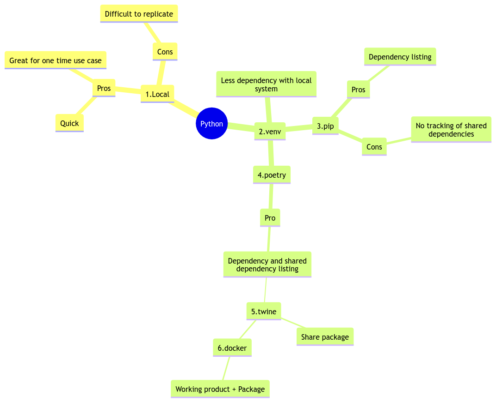

# Making Unicorns fly with Python #

 <a href="https://github.com/tarikub/flying-unicorn">
    
  </a>

> The steps below assume that you have already installed Python on your local machine and are using Py-launcher to interact with the Python interpreter.

Here are six different ways to set up a Python project:

1. `1.local` - Running Python on your local machine (YOLO)
2. `2.venv` - Using Python virtual environments
3. `3.pip` - Using `pip` for local package management
4. `4.poetry` - Using `poetry` for local package management
5. `5.twine` - Using `Twine` to publish and distribute code
6. `6.docker` - Using `Docker` to reliably reconstruct a Python package during build

## 1. Local Machine Development (YOLO) ##

Run Python directly on your local machine.

1) Go to the `1.local` folder and run the following command:

```py
py .\run.py
```

If you encounter any errors while running the Python file, you might want to check your Py launcher settings by running the following commands:

```
py -0 # Windows Py launcher
py -0p # Windows Py launcher with paths
```

You can also create a `py.ini` file in `%LOCALAPPDATA%` to pick a Python version that works for running the code. For example
```
[defaults]
python=3.10
```

***Drawbacks***
- Can I run it? ANS: _Maybe_
- Are there any dependencies? ANS: _Unknown_
- Will it execute successfully? ANS: _At least once it does_

## 2. Virtual Env Development

Create a virtual environment called `2.venv`

```
python3 -m venv 2.venv
```

Activate the environment:

Windows
```
2.venv\Scripts\activate
```
Mac/Linux
```
source 2.venv/bin/activate
```

Review the virtual environment configuration file `pyvenv.cfg`

Run `python run.py`

***Improvements***
- Can I run it? ANS: _Yes_
- Are there any dependencies? ANS: _Now safely in PIP_

***Drawbacks***
- Will it execute successfully? ANS: _At least once it does_

## 3. Virtual Env Development and PIP

Create a virtual environment called `3.pip`

```
python3 -m venv 3.pip
```

Activate the environment:

Windows
```
3.pip\Scripts\activate
```
Mac/Linux
```
source 3.pip/bin/activate
```

___Install Dependencies___ 

- Run  `pip install colorama`
- Run  `py .\run.py` 

If run doesn't work upgrade PIP and reinstall `colorama` with 

To lock-in dependencies one can run:

```
pip freeze > requirements.txt
```

***Improvements***
- Can I run it?  ANS: _Yes_
- Dependencies? ANS: _Now Safely in PIP_
- Dependencies can be locked? ANS _Yes for the most part_

***Drawbacks***
- Will it successfully execute? ANS: _At least once it does_

## 4. Virtual Env Development, PIP and Poetry ##

Create virtual environment under `4.poetry`

```
py -m venv .

```

activate environment with 

Windows
```
\script\activate 

```
Mac/Linux
```
/bin/activate
```

Upgrade PIP and install `poetry`

```
python -m pip install --upgrade pip
pip install poetry
```

- Run `poetry init` to set up new poetry project
- Run `poetry add colorama` to add `colorama`
- Run `poetry add rich==2.2.3` to add `Rich`
- Note: command `Updating typing-extensions (4.7.1 -> 3.10.0.2)`

***Improvements***
- Can I run it?  ANS: _Yes_
- Dependencies? ANS: _Now Safely in Poetry_
- Dependencies can be locked? ANS _Yes, together with dependencies of dependencies_

***Drawbacks***
- Will it successfully execute? ANS: _For the most part_

## 5. Virtual Env Development, PIP, Poetry and Twine  ##

Create virtual environment under `4.poetry`

```
py -m venv .

```

activate environment with 

Windows
```
\script\activate 

```
Mac/Linux
```
/bin/activate
```

Upgrade PIP and install `poetry`

```
python -m pip install --upgrade pip
pip install poetry
```

- Run `poetry init` to set up new poetry project
- Run `poetry add colorama` to add `colorama`
- Run `poetry add rich==2.2.3` to add `Rich`
- Note: command `Updating typing-extensions (4.7.1 -> 3.10.0.2)`
- Add a private repository where you would like your package to go to with

```
poetry config repositories.[somerepo] https://[somelink]/pypi/simple/
```
Followed by your access tokens for the private repo with

```
poetry config add  [somerepo] [username] [access token]
```
To build the package run

```
poetry build
```
To publish the package run

```
twine upload -u [username] -p [access token] --repository-url  https://[somelink]/pypi/upload dist/*
```

***Improvements***
- Can I run it?  ANS: _Yes_
- Dependencies? ANS: _Now Safely in Poetry_
- Dependencies can be locked? ANS _Yes, together with dependencies of dependencies_

***Drawbacks***
- Will it successfully execute? ANS: _For the most part_

## 6. Virtual Env Development, PIP, Poetry, Twine and Docker  ##

- Update `DockerFile` and replace `https://[somelink]/pypi/upload ` with real private repository link
- Run docker build to build, generate, and push package into private repository with

```
docker compose build --build-arg UserCredential="[UserCredential]" --build-arg AccessToken="[AccessToken]" --no-cache --progress plain
```

***Improvements***
- Can I run it?  ANS: _Yes_
- Dependencies? ANS: _Now Safely in Poetry_
- Dependencies can be locked? ANS _Yes, together with dependencies of dependencies_

***Drawbacks***
- Will it successfully execute? ANS: _Yes, all the time!!!_